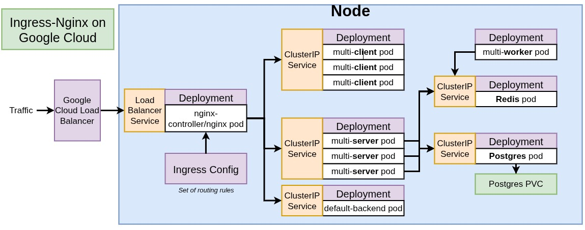

# Architecture



## Deploy Steps

### 1 - Google Cloud Kubernetes setup from cloud shell

- gcloud config set project <project_id>
- gcloud config set compute/region <cluster_location>
- gcloud container clusters get-credentials <cluster_name>


### 2 - Installing Helm to Google Cloud Kubernetes Cluster using cloud shell 

- curl -fsSL -o get_helm.sh https://raw.githubusercontent.com/helm/helm/main/scripts/get-helm-3
- chmod 700 get_helm.sh
- ./get_helm.sh

or check the [link](https://helm.sh/docs/intro/install/#from-script)

### 3 - Installing Kubernetes ingress-nginx

```bash
helm upgrade --install ingress-nginx ingress-nginx \
  --repo https://kubernetes.github.io/ingress-nginx \
  --namespace ingress-nginx --create-namespace \
  --set controller.resources.requests.cpu=100m \
  --set controller.resources.requests.memory=90Mi \
  --set controller.resources.limits.cpu=200m \
  --set controller.resources.limits.memory=180Mi \
  --set defaultBackend.resources.requests.cpu=50m \
  --set defaultBackend.resources.requests.memory=60Mi \
  --set defaultBackend.resources.limits.cpu=100m \
  --set defaultBackend.resources.limits.memory=120Mi \
  --set admissionWebhooks.patch.resources.requests.cpu=50m \
  --set admissionWebhooks.patch.resources.requests.memory=60Mi \
  --set admissionWebhooks.patch.resources.limits.cpu=100m \
  --set admissionWebhooks.patch.resources.limits.memory=120Mi

```

# COMMON COMMANDS 

## MINIKUBE

- minikube start
- minikube stop
- minikube ip (returns the virtual machine ip)
- minikube service client-node-port --url
- minikube service ingress-nginx-controller -n ingress-nginx --url

## KUBECTL

- kubectl apply -f client-pod.yaml
- kubectl apply -f client-node-port.yaml
- kubectl get pods
- kubectl get services
- kubectl describe <type> <name>  -  kubectl describe pod client-pod
- kubectl delete <kind_of_object> <object_name> - kubectl delete deployment client-deployment
- kubectl delete -f <file_path> - kubectl delete -f client-pod.yaml
- kubectl set image <object_type> / <object_name> <container_name>=<new_image_to_use>
- kubectl get storageclass
- kubectl get pv - pv = persistente volume
- kubectl get pvc - pvc = persitent volume claims
- kubectl create secret generic pgpassword --from-literal PGPASSWORD=12345asdf
- kubectl get secrets


### NODE

nodes are individual machines or vm's that run containers

## Accessing docker server inside minikube

- eval $(minikube -p minikube docker-env)